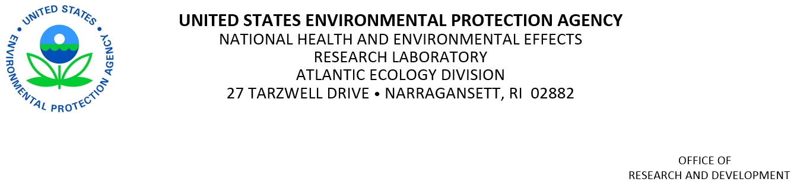

January 25, 2016 \newline

Editor, *F1000Research*\newline
London, England\newline

To whom it may concern,

Please accept, for your review, "Associations between chlorophyll *a* and various microcystin-LR health advisory concentrations" to be published in *F1000Research*.  In this article we detail a conditional probability analysis of the USEPA's 2007 National Lakes Assessment in which we identify chlorophyll *a* concentrations that are associated with several microcystin-LR health advisories.  Making these associations is important because it allows identification of a large number of lakes that may be posing a public health hazard because of high concentrations of cyanotoxins.  Direct measurements of microcystin-LR are becoming more commonplace, but at the current time they are still relatively rare.  Chlorophyll *a* measurements are much more common and can be used to help identify potential problems.  We are also pleased to submit this to *F1000Research* as we are proponents of practicing open science.  Towards that end all of the data and source code for this manuscript are available as an R package via GitHub (https://github.com/USEPA/microcystinchla).  Any questions or concerns about this submission, please do not hesitate to contact us.

Sincerely,

Jeffrey W. Hollister
401 782 9655
hollister.jeff@epa.gov

Betty J. Kreakie
kreakie.betty@epa.gov
